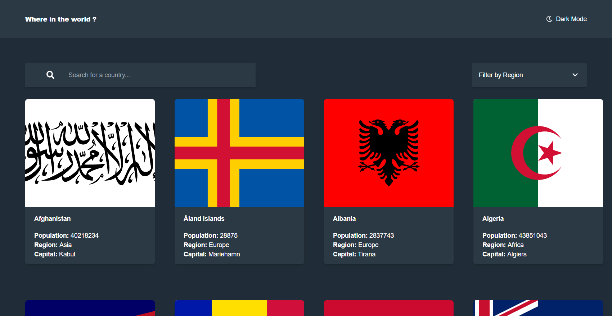

# Frontend Mentor - REST Countries API with color theme switcher solution

This is a solution to the [REST Countries API with color theme switcher challenge on Frontend Mentor](https://www.frontendmentor.io/challenges/rest-countries-api-with-color-theme-switcher-5cacc469fec04111f7b848ca). Frontend Mentor challenges help you improve your coding skills by building realistic projects.

## Table of contents

- [Overview](#overview)
  - [The challenge](#the-challenge)
  - [Screenshot](#screenshot)
  - [Links](#links)
- [My process](#my-process)
  - [Built with](#built-with)
  - [What I learned](#what-i-learned)
  - [Continued development](#continued-development)
  - [Useful resources](#useful-resources)
- [Author](#author)
- [Acknowledgments](#acknowledgments)

## Overview

### The challenge

Users should be able to:

- See all countries from the API on the homepage
- Search for a country using an `input` field
- Filter countries by region
- Click on a country to see more detailed information on a separate page
- Click through to the border countries on the detail page
- Toggle the color scheme between light and dark mode _(optional)_

### Screenshot

### Links

- Solution URL: [Solution URL](https://www.frontendmentor.io/challenges/rest-countries-api-with-color-theme-switcher-5cacc469fec04111f7b848ca/hub/rest-countries-api-with-color-theme-switcher-LrYLgd9Wf/solutions)
- Live Site URL: [Live site URL](https://rest-countries-eight.vercel.app/home)

## My process

### Built with

- HTML5
- Flexbox
- CSS Grid
- Mobile-first workflow
- [Angular](https://angular.io//) - Angular
- [TailwindCSS](https://tailwindcss.com/) - A utility-first CSS framework
- [Restcountries Api](https://restcountries.com/) - Get information about countries via a RESTful API

### What I learned

Through this project I attained a better understanding of RxJs and Observables, [Using TailwindCSS with Angular](https://dev.to/edoriatiri/using-tailwind-30-with-angular-13-3cg9), troubleshooting errors and thinking programmatically - I was able to use memoization to [cache http responses from the Restcountries api using the shareReplay RxJS operator](https://betterprogramming.pub/how-to-create-a-caching-service-for-angular-bfad6cbe82b0) amongst many other valuable things.

### Useful resources

- [How To Create a Caching Service for Angular](https://betterprogramming.pub/how-to-create-a-caching-service-for-angular-bfad6cbe82b0)
  [How to implement an Angular search filter in Angular 11 and 12](https://edupala.com/how-to-implement-an-angular-search-filter-in-angular/)
  [Reloading Components when change in Route Params — Angular](https://medium.com/@mvivek3112/reloading-components-when-change-in-route-params-angular-deed6107c6bb)
  [FortAwesome/angular-fontawesome](https://github.com/FortAwesome/angular-fontawesome)

## Author

- Website - [Edor Atiri](https://edori-dev-portfolio.vercel.app/)
- Frontend Mentor - [@EdoriAtiri](https://www.frontendmentor.io/profile/EdoriAtiri)
- Twitter - [@Reuben_iri](https://twitter.com/Reuben_iri)

## Acknowledgments

Grateful to Frontend Mentor for making this awesome challenge available for nothing.
